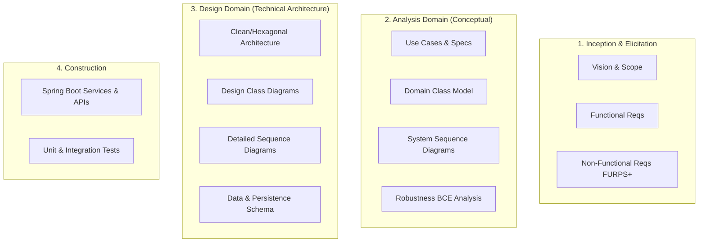

# Spring Trainer - Software Engineering Workspace

This project is structured following the **Unified Process (UP / RUP)** methodology, managed by the **Systems Analyst & Software Architecture** agent.

## 🧭 Engineering Workflow

## 📂 Documentation Directory

- [`docs/requirements/`](file:///home/mateoromero/Backend/spring-trainer/docs/requirements): Vision, FURPS+ Requirements, and User Stories.
- [`docs/analysis/`](file:///home/mateoromero/Backend/spring-trainer/docs/analysis): Conceptual Class Models, Use Case Specifications, SSDs.
- [`docs/design/`](file:///home/mateoromero/Backend/spring-trainer/docs/design): Architectural decisions, Design Class Diagrams, Sequence Diagrams, DB Schemas.
- [`docs/templates/`](file:///home/mateoromero/Backend/spring-trainer/docs/templates): Standardized UP engineering templates.
