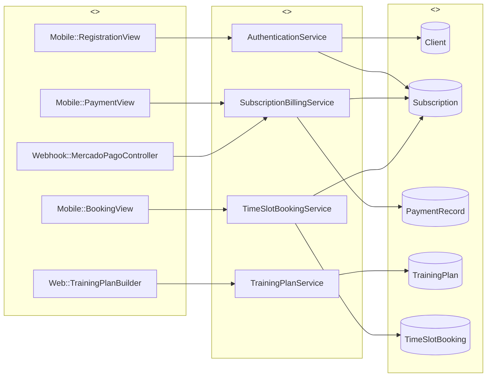
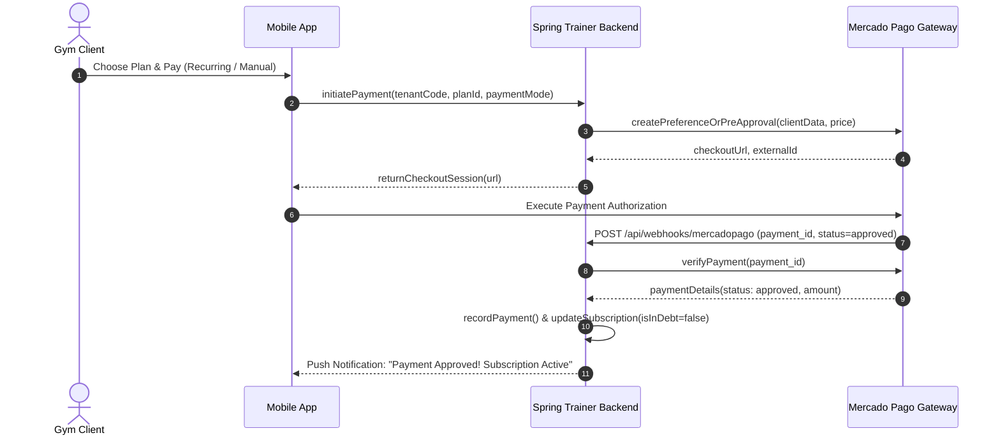
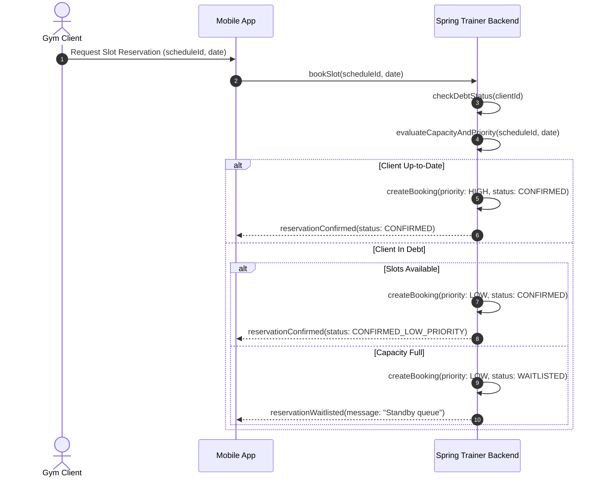

```markdown
    # Robustness Analysis & System Sequence Diagrams

    ## 1. Robustness BCE Model (Boundary - Control - Entity)
```

---
  ## 2. System Sequence Diagram (SSD): Mercado Pago Webhook & Debt Clearance

---
  ## 3. System Sequence Diagram (SSD): Slot Reservation with Priority

---
