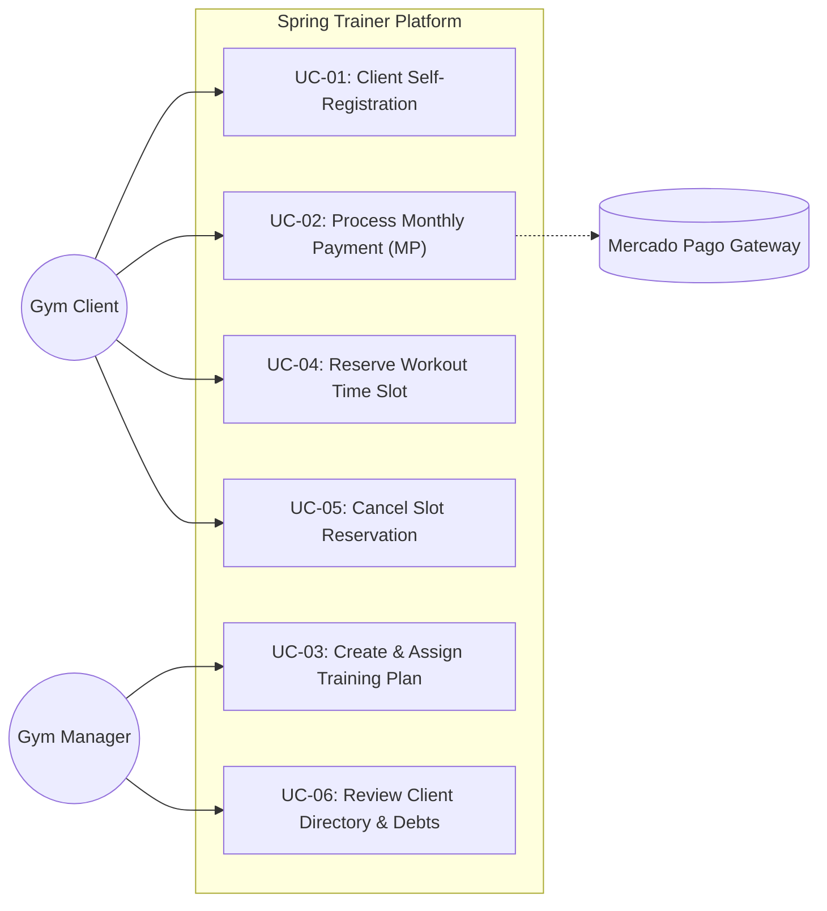

```markdown
# Use CaseSpecifications
```

---
### 🔹 UC-01: Client Self-Registration & Gym Enrollment

- Actor: Gym Client (Mobile App)
- Preconditions: Gym Tenant is active.
- Main Success Scenario:
     1. Client inputs email, password, full name, phone number, emergency contact, and the gym tenant code.
     2. System validates email uniqueness within the tenant scope.
     3. System creates a Client entity and initial Subscription record with AccountStatus = PENDING_PAYMENT.
     4. System prompts the client to select a MembershipPlan and configure Mercado Pago.
- Postconditions: Client account registered; login credentials active.
---
  ### 🔹 UC-02: Process Monthly Subscription (Mercado Pago)

- Actor: Gym Client / Mercado Pago Webhook
- Main Success Scenario:
  1. Client selects payment mode: Automated Recurring or Manual Monthly.
  2. System requests a Checkout Preference or PreApproval ID from Mercado Pago API.
  3. Client authorizes payment within the Mercado Pago gateway.
  4. Mercado Pago emits a webhook notification (POST /api/webhooks/mercadopago) with payment ID and status approved.
  5. System validates the webhook signature, creates a PaymentRecord, updates Subscription.currentPeriodEnd, and sets Subscription.isInDebt = FALSE.
- Alternative Flow (Payment Failure / Rejection):
  - Mercado Pago emits status rejected. System logs payment as failed. If current date

        th>10, Subscription.isInDebt is set to TRUE.
---
  ### 🔹 UC-03: Create and Assign Personalized Training Plan
- Actor: Gym Manager (PC Web Dashboard)
- Preconditions: Client is enrolled.
- Main Success Scenario:
  1. Manager opens client profile from the directory.
  2. Manager creates a new TrainingPlan (Title, Objective, Dates).
  3. Manager adds RoutineDay items (e.g., Day A: Chest & Core).
  4. Manager adds PlannedExercise items specifying sets, reps, target weight, rest time, and execution notes (from catalog or freeform).
  5. Manager publishes the plan. System marks the plan ACTIVE and pushes an update to the client's mobile app.

---
  ### 🔹 UC-04: Reserve Workout Time Slot

- Actor: Gym Client (Mobile App)
- Preconditions: Gym has slotBookingEnabled = TRUE.
- Main Success Scenario:
    1. Client views available schedule for a target date.
    2. Client selects a time slot.
    3. System evaluates client debt status and remaining capacity:
        - Up-to-date client: Confirmed with HIGH_PRIORITY.
        - In-debt client: Confirmed with LOW_PRIORITY if spots are open; placed on waitlist if capacity is tight.
    4. System saves TimeSlotBooking.

---
  ### 🔹 UC-05: Cancel Slot Reservation

- Actor: Gym Client (Mobile App)
- Preconditions: Client has a confirmed TimeSlotBooking.
- Main Success Scenario:
    1. Client selects their active booking and requests cancellation.
    2. System verifies (SlotStartTime - CurrentTime) >= 24 hours.
    3. System updates booking status to CANCELLED.
    4. If a waitlisted client exists, system promotes the highest priority waitlisted client to CONFIRMED.
- Exception Flow:
    - Time remaining <24 hours: System rejects penalty-free cancellation.  

---
      
