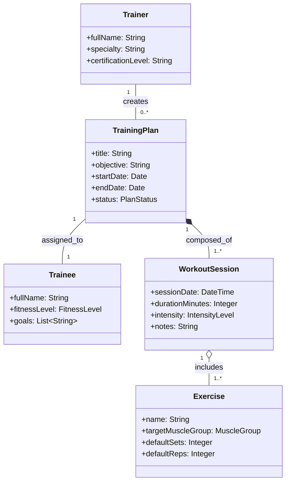

# Domain Model & Conceptual Class Modeling Guidelines

## Objective
Capture real-world concepts, business entities, associations, and domain attributes independent of software technology (no getters/setters, no database IDs as foreign key columns, no framework types).

---

## 1. Notation & Structure
- **Conceptual Classes**: Nouns representing meaningful domain abstractions (e.g., `Trainer`, `TrainingPlan`, `Exercise`, `WorkoutSession`).
- **Attributes**: Key descriptive properties (e.g., `name: String`, `durationMinutes: Integer`, `targetHeartRate: Range`).
- **Associations & Multiplicities**:
  - `1` (Exactly one)
  - `0..1` (Zero or one)
  - `1..*` (One or more)
  - `*` or `0..*` (Zero or more)
- **Relationships**:
  - Association (`--`)
  - Aggregation (`o--`)
  - Composition (`*--`)
  - Generalization / Inheritance (`<|--`)

---

## 2. Mermaid Domain Class Diagram Example

