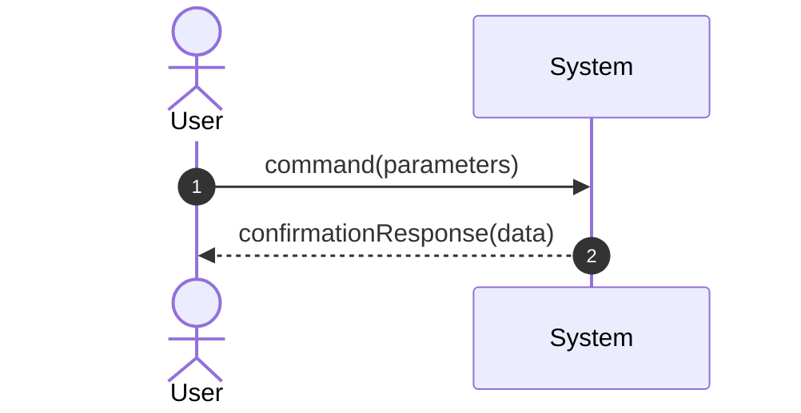

# Use Case Specification: UC-[ID] - [Use Case Name]

## 1. Description
Brief summary of the goal and user interaction.

## 2. Actors
- **Primary Actor**: 
- **Secondary / Supporting Actors**: 

## 3. Preconditions
- What conditions must hold true before this use case begins?

## 4. Postconditions
- **Success Postcondition**: State of the system after successful execution.
- **Failure / Cancellation Postcondition**: State if aborted.

## 5. Main Success Scenario (Basic Flow)
1. Actor triggers the use case by [action].
2. System validates [input / state].
3. System executes [business rule / calculation].
4. System updates [domain entity].
5. System displays / returns [result].

## 6. Alternative Flows
- **3a. Condition X occurs**:
  1. System notifies actor.
  2. Actor selects alternate option.
  3. Resume at Step 4.

## 7. Exception / Error Flows
- **2a. Validation Failure**:
  1. System aborts operation and emits error code.
  2. Use case terminates with failure.

## 8. Special Requirements & Business Rules
- **BR-001**: Description of domain constraint.
- **NFR Traces**: Reference to relevant FURPS+ requirements.

## 9. Sequence Diagram (Analysis Level / SSD)

